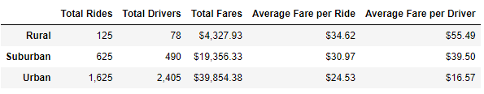
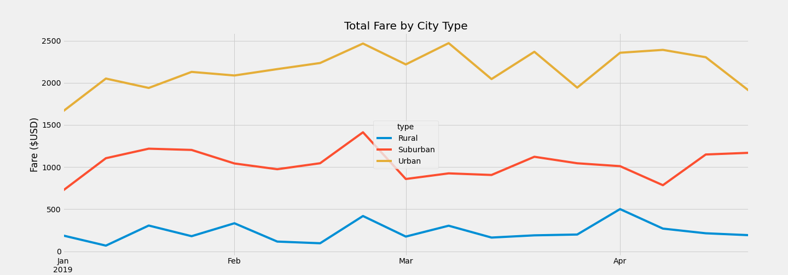

# Pyber Ride-Sharing Analysis
## Overview
The purpose of this analysis is to look at the ride-sharing data of urban, suburban, and rural city types. The data of each was retrieved to create a straightforward dataframe featuring the amount of rides, drivers, and fares, as well the average number of drivers and fares. After this, the dates of rides -- over a four month timespan at the start of the year -- were used to create a multiple line chart showing the average weekly fares for each city type over the course of those months.
## Results
To start off, we have the overall data for urban, suburban and rural city types. As one might expect, the total fare, total number of rides, and total number of drivers is greatest in urban cities and fewest in rural cities. In urban cities, the number of rides was more than ten times greater than the number of rides in rural cities, and rural cities have a tiny percentage of drivers compared to the amount of drivers urban cities have. Suburban cities fit pretty evenly between the two.

As we can see from the data summary, the average fare per ride and average fare per driver is where the numbers start leaning the other way. While there are far fewer rides in rural cities, the drivers make, on average, about $55 per side; drivers in urban cities make almost $17 dollars per ride, meaning on average, urban drivers have to give 3 rides to make what a rural driver makes from a single ride. Even drivers in suburban cities make more than twice the amount on average compared to their urban counterparts.
However, as shown in the chart below, urban drivers bring in the overwhelming majority of the total fare. The chart also shows us a general trend of when the service is used in each city type. We can see that at the start of the year, the fare -- and therefore the rides -- start picking up in urban and suburban cities, but drops in rural cities. We can also see that suburban cities had the biggest drop off, and that in suburban cities and rural cities, the fare is steadier compared to urban cities, which rises fairly steadily at first, but then zig-zags for the entirety of March. All the cities experience a peak in late February followed by a steep decline.

## Summary
Overall, from this chart, suburban cities appear to be the most consistent. With the exception of two points, the total fare rises and falls at a fairly steady rate. Rural cities look more chaotic, possibly due to the fewer overall rides. Urban cities are sort of a mix of both, but reliable bring in the most money regardless of other factors.
However, this data does not take into account several factors that would better inform decision making going forward. For example, we can assume there is a correlation between the number of rides and the fare, but this chart does not expressly tell us that. Rural cities being what they are, the higher average fare could be due to longer rides, scarcity, or another factor. We do not have potential data that may skew its data included.
One factor to consider that would refine this analysis is the weather, since inclement weather can affect number of rides and cost of rides both. Does that affect differ across the city types? If so, by how much? Another factor to look at would be the holidays/events that occur, such as spring break, Valentine's Day, and Easter. What affect, if any, did they have on the fare and number of rides across the city types? Were more drivers out due to the holiday, or fewer? All of these things can give a better idea of our success, and how that success can possibly be pushed to greater heights.
